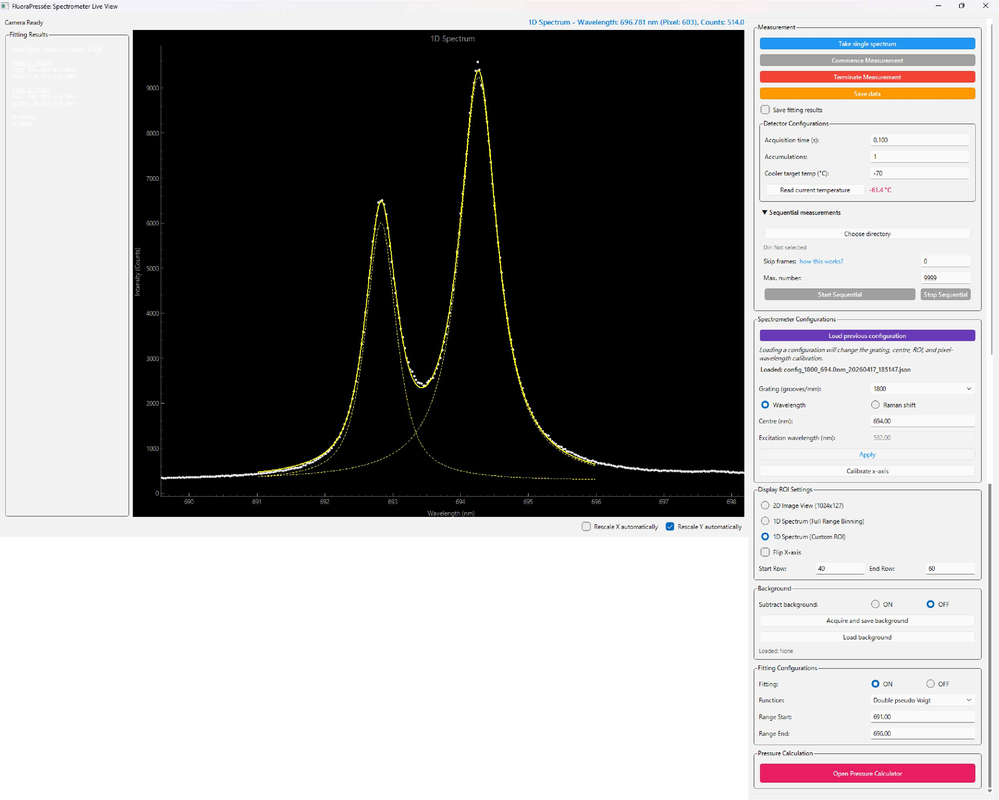
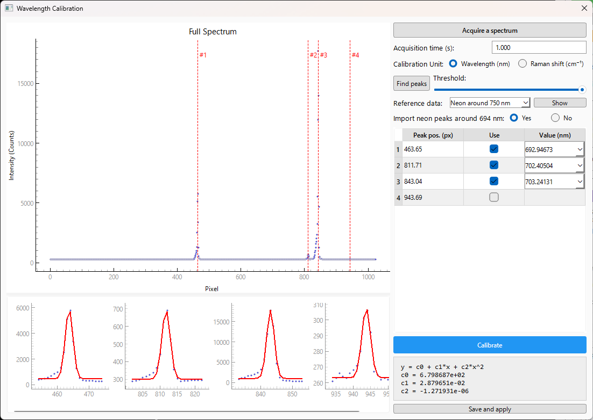
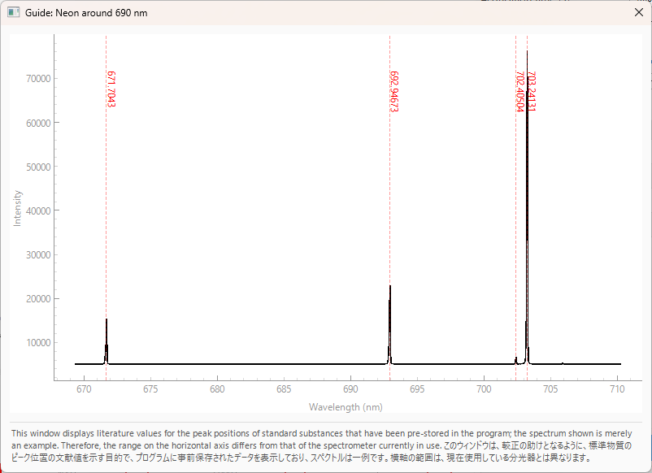
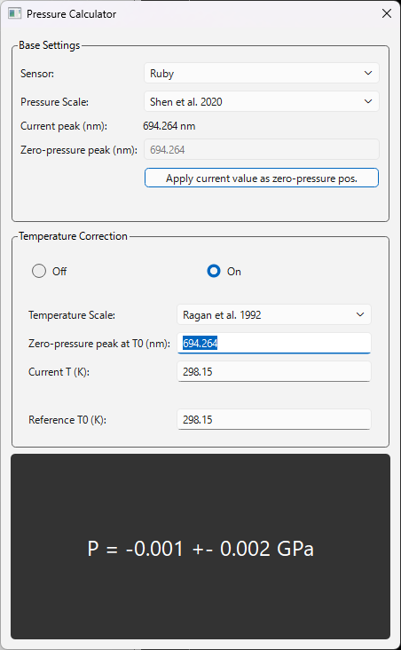

# FluoRaPressée: Spectrometer Control & Analysis GUI

* Author: Hiroki Kobayashi (Geochemical Research Center, The University of Tokyo). 
    * https://orcid.org/0000-0002-3682-7558 
    * E-mail as of 2026: hiroki (at) eqchem.s.u-tokyo.ac.jp

スペクトルのリアルタイム取得からバックグラウンド補正、キャリブレーション、ピークフィッティング、そして高圧実験における圧力計算までを一貫して行うためのPythonベースのGUIアプリケーションです。現在、Andor、Princeton Instruments、Ocean Opticsの分光器に対応しています。


## 必須環境 (Requirements)

* **OS**: Windows 10 / 11 (Andor SDK・Princeton Instruments PICam Runtime のいずれもWindows専用のため)
* **Python**: Python 3.9 以上, 3.13以下
* **Hardware**: 以下のいずれかの組み合わせに対応しています（起動時の設定ウィザードで選択します）
  * Andor製 カメラ（検出器）+ Andor製 分光器（Kymera / Shamrock シリーズ、``ShamrockCIF.dll`` 経由で制御）
  * Princeton Instruments製 カメラ（検出器、PICam対応機種）+ Princeton Instruments製 分光器（Acton SP シリーズ、シリアル(COMポート)通信で制御）
  * Ocean Optics製分光器
* **Drivers/SDK**:
  * Andorの場合: Andor SDK (ドライバパッケージがPCにインストールされている必要があります)
  * Princeton Instrumentsの場合: PICam Runtime（カメラSDK。分光器側は追加ドライバ不要でシリアルポート経由で通信します）

## インストール方法 

1. リポジトリをクローンします。AndorまたはPrinceton Instrumentsを使用する場合は、``setup.bat``をダブルクリック
   （またはコマンドプロンプト/PowerShellから実行）します。Ocean Opticsを使用する場合は、代わりに
   ``setup_oceanoptics.bat``を右クリックして「管理者として実行」します。
   プロジェクトフォルダ内に仮想環境``.venv``が作成され、``requirements.txt``に記載された必要なPythonパッケージ
   （``PyQt6``, ``pyqtgraph``, ``numpy``, ``scipy``, ``pylablib``, ``pyserial``、および後述のAPI機能用の
   ``fastapi``, ``uvicorn``, ``pydantic``）がすべて自動的にインストールされます。
   手動でインストールする場合は、作成した仮想環境内で ``pip install -r requirements.txt`` を実行してください。
2. 使用する装置メーカーに応じて、SDK/ドライバを正しくインストールします。
   * Andorの場合: Andor SDK
   * Princeton Instrumentsの場合: PICam Runtime（カメラ用）。分光器（Acton SP シリーズ）はシリアル接続のため、PC側のCOMポート番号を確認しておきます。
   * Ocean Opticsの場合: ``setup.bat``を先に実行する必要はありません。``setup_oceanoptics.bat``の1回の実行で、
     仮想環境の作成、共通パッケージと``seabreeze``のインストール、``seabreeze_os_setup``による
     OS依存の設定まで自動的に行われます。macOS/Linuxでは``./setup_oceanoptics.sh``を``./setup.sh``の代わりに実行します。
3. ``spectrometerConfig.json``が存在しない状態でアプリを初めて起動すると、セットアップウィザードが自動的に開きます。
   装置メーカー・接続設定・回折格子構成などを入力すると、``spectrometerConfig.json``がプロジェクトルートに
   生成されます。ウィザードの各ステップおよび``spectrometerConfig.json``自体の詳しい仕様は
   [オンラインマニュアルの「ハードウェア設定」](https://khsacc.github.io/FluoRaPressee/docs/hardware-config)
   を参照してください。

##  使い方 

``FluoRaPressee_run.bat``をダブルクリック（またはコマンドプロンプト/PowerShellから実行）すると、選択したsetupスクリプトで作成した仮想環境を使ってアプリが起動します。

<!-- ※ ハードウェアを接続せずにUIのテストだけを行いたい場合は、``FluoRaPressee_run_debug.bat``を使うとデバッグモードで起動できます。

macOS/Linux上でUI開発のみ行う場合（ハードウェア制御は非対応）は、``./setup.sh``と``./FluoRaPressee_run_debug.sh``を使用してください。 -->

### Analysis Modeをスタンドアロンで起動する

保存済みの1Dスペクトルを読み込んでフィッティングや圧力計算を行うAnalysis Modeは、装置制御用のメイン画面を起動せず、単独で使用できます。プロジェクトのルートフォルダで次のコマンドを実行してください。

Windows（``setup.bat``で作成した仮想環境を直接使用する場合）:

```powershell
.venv\Scripts\python.exe analysis_main.py
```

仮想環境をすでに有効化している場合:

```bash
python analysis_main.py
```

macOS/Linux（``setup.sh``で作成した仮想環境を直接使用する場合）:

```bash
.venv/bin/python analysis_main.py
```

Analysis Modeの起動には、カメラ・分光器の接続、装置SDK、``spectrometerConfig.json``は必要ありません。未較正のpixel軸データでもフィッティングは可能ですが、圧力計算には波長またはRaman shiftで較正されたデータが必要です。

## ローカルでオンラインマニュアルを確認

```bash
cd docs-site
NODENV_VERSION=22.22.0 npm start
```

## スクリーンショット


### メイン画面



* スペクトルの取得、保存
    * 単発測定および連続測定
    * インターバルを指定した連続保存・連続解析もできます。
* 分光器の基本的な制御（回折格子の変更、中心位置の変更）
* ROI の設定、イメージモード（CCDで取得した画像をそのまま出力）への切り替え
* バックグラウンドの取得と差し引き
* ピーク函数を用いたフィッティング
* 圧力計算ウィンドウを開く


### 横軸較正画面（「Calibrate x-axis」ボタンをクリックして開く）



* 標準試料のスペクトルを取得し、ピーク検索、Gaussian函数によるピークフィット、波長の較正までを行えます。


### 横軸較正補助画面



* よく使うネオンの波長領域のスペクトル（事前に測定してプログラム中に保存したもの）を表示してピークの帰属の参考にできます。


### フィッティング

* Pseudo-Voigt, Moffat, Gaussian, Lorenzian の4種類の関数に対応
* ピーク数の最大は５まで。


### 圧力計算画面（「Open pressure calculator」ボタンをクリックして開く）




## API機能（同一LAN内の他PCからの操作）

校正やROI設定などの基本操作をGUI内で完結させたのち、画面下部の「API Server」パネルで
**Start API Server** を押すと、同一LAN内の他PCからHTTP経由で測定をトリガーできるようになります。
起動するとURLとAPIキーが表示されるので、それを使いたい相手に共有してください。APIサーバーが
起動している間、GUI側の測定・設定系操作はロックされ（プロットの表示設定等は引き続き操作可）、
**Stop API Server** を押すとローカルでの操作権が戻ります。

エンドポイント一覧・リクエスト/レスポンスの詳細は [オンラインマニュアルのAPIリファレンス](https://khsacc.github.io/FluoRaPressee/docs/api) を参照してください。

## 保存されるファイルの形式

測定データ、バックグラウンド、フィッティング結果、連続測定のログ、Configuration（較正込みの装置設定）
など、アプリが保存する各ファイルの形式については
[オンラインマニュアルの「保存データの形式」](https://khsacc.github.io/FluoRaPressee/docs/data-formats)
を参照してください。

## 実機試験

開発段階では、以下の実機を用いて動作確認を行っております。

| 製造元 | 分光器 | 分光器との通信  | 検出器  | 検出器との通信 | 場所 |
| --- | --- | --- | --- |  --- |  --- | 
| Zolix (Andor) | Omni-λ5006i | USB | iVac316 | USB | 東京大学 |
| Andor | Kymera KY-2775 | USB | iDus DV401 | USB | 東京大学 |
| Princeton Instruments | Acton SpectraPro SP-2750 | RS-232C–USB | ProEM 1600<sup>2</sup> | GigE | BL-18C, PF, KEK |
| Ocean Optics | USB2000 | USB | USB2000 | USB | 東京大学 |


## 謝辞

このプログラムは私が作成したものですが、機能やデザインに関する多くのアイデアは、私がStefan Klotz氏との共同研究のためにフランス・パリ・ソルボンヌ大学-CNRS UMR 7590 IMPMCに滞在した際によく使用していた、[Rubycond](https://github.com/CelluleProjet/Rubycond) プログラムから着想されたものです。Rubycondの開発者であるYiuri Garino 氏に感謝申し上げます。またこのプログラムは東京大学大学院理学系研究科附属地殻科学実験施設 鍵裕之
教授・小松一生准教授の研究室で開発されました。最後に、開発に際してClaude CodeおよびGeminiに助けを借りたことを申し添えます。
